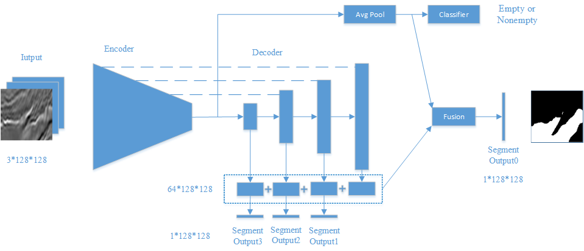

## Segmenting salt deposits from seismic images with deeply-supervised Unet (PyTorch)

## General
I have participated in the Kaggle competition [TGS Salt Identification Challenge](https://www.kaggle.com/c/tgs-salt-identification-challenge) and reached the 113-th place out of 3200+ teams. This repository contains my original code that is in the format of Jupitar Notebook (.ipynb) as well as a cleaned up version.

## Data preprocessing
The original images with size 101x101 px were padded to 128x128 px, then [integrated with position information](https://eng.uber.com/coordconv/) and finally stacked into 3-channel images. Random crop to the input size 128x128 px, horizonal flip, slight rotation and random linear brightness augmentation were applied.

## Model design:
I used a U-Net like architecture with a ResNet34 encoder and very simple Decoder blocks. A special deep superversion structure was added to speed up training and avoid overfitting (as shown in the picture). As a whole, the model has a very slim structure with only 22,190,693 parameters. Due to the limitation of computation power, I did not try deeper encoders like SE-ResNeXt50, which will possibly further boost the performance.

## Models Training
Optimizer: SGD with LR 0.01, momentum 0.9, weight_decay 0.0001

Train stages:

1) 300 epoches, Lovasz hinge loss, input image size 128x128.
2) 300 epoches, Lovasz hinge loss, resized to 192x192.
3) [Cosine annealing learning rate](https://openreview.net/forum?id=BJYwwY9ll) 200 epochs, 50 per cycle; max_lr = 0.01, min_lr = 0.001.

## Cross Validation
Averaged results of five folds used in the final submission.

